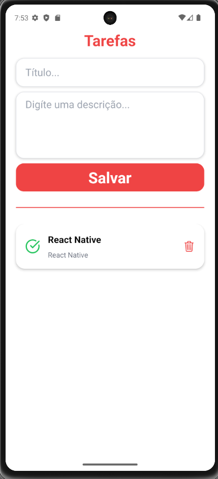

# 📋 Tarefas App

Aplicativo mobile de gerenciamento de tarefas desenvolvido com **React Native** e **Expo**.

O app permite criar, visualizar detalhes, marcar tarefas como concluídas e remover tarefas. Os dados são armazenados localmente usando **SQLite**.

---

## 🚀 Tecnologias usadas

- React Native
- TypeScript
- SQLite 
- Componentização

---

## ✨ Funcionalidades

✅ Criar tarefas  
✅ Listar tarefas  
✅ Visualizar detalhes da tarefa em Modal  
✅ Marcar tarefa como concluída  
✅ Voltar tarefa para pendente  
✅ Excluir tarefas  
✅ Armazenamento local com SQLite  
✅ Interface moderna com componentes reutilizáveis

---

## 📱 Preview

---